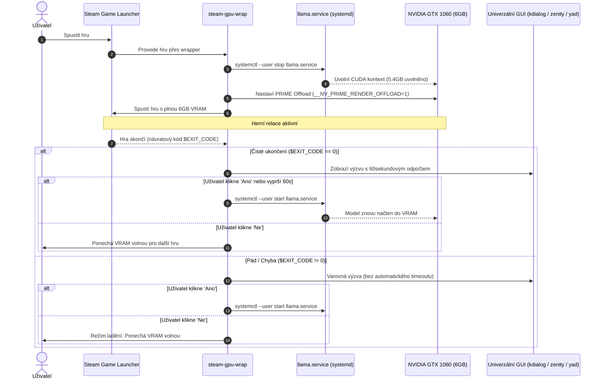

# Správce GPU VRAM a lokálních AI modelů pro Steam (`steam-vram-manager`)

  
[🇬🇧 English version available here](./README.md)

Inteligentní, **desktopově agnostický** orchestrátor grafické paměti (VRAM) a zátěže lokálních jazykových modelů pro Linuxové pracovní stanice s kartami NVIDIA, které provozují lokální LLM (`llama.cpp` / `llama-server`) souběžně s hraním her přes Steam Proton.

Funguje napříč **jakýmkoliv desktopovým prostředím**: KDE Plasma, GNOME, XFCE, MATE, Cinnamon, LXQt, Sway, i3, Hyprland atd.

---

## 🎯 Problém

Při provozu lokálních LLM (např. Mistral 7B, Qwen 2.5 Coder) přes `llama.cpp` s téměř kompletním offloadem vrstev do grafické karty (`--n-gpu-layers 99`) zabírá samotný model **~5.38 GB VRAM**.

Na **6GB grafické kartě (jako je GTX 1060)** vede spuštění jakékoliv moderní hry ve Steamu k okamžitému selhání alokace VRAM (Out-Of-Memory / OOM), chybám inicializace Vulkanu nebo masivnímu zasekávání.

---

## 💡 Řešení

`steam-vram-manager` vytváří synchronní, spolehlivý most mezi životním cyklem hry ve Steamu a systémovým démonem `llama.service` (systemd):

---

## ✨ Klíčové vlastnosti

- **Univerzální kompatibilita:** Automaticky detekuje grafické prostředí a naváže se na nativní GUI dialogy (`kdialog`, `zenity`, `yad`). Pokud běží bez GUI, spolehlivě funguje v terminálu.
- **Zero-Waste architektura:** Žádná trvalá alokace navíc, uvolňuje 100 % VRAM přesně ve chvíli, kdy ji hra potřebuje.
- **Odolnost proti chybám:** Ošetření pádů hry i neočekávaných stavů systemd démona.
