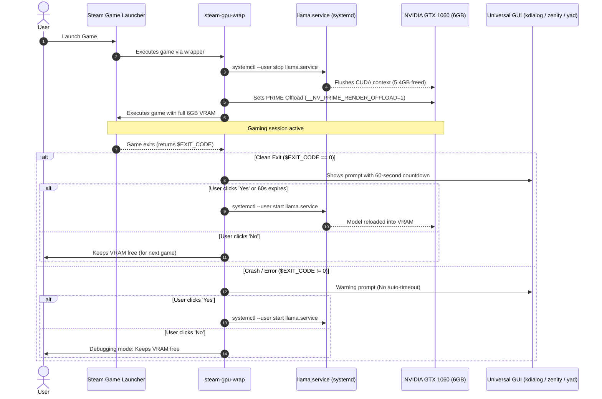

# Steam VRAM & AI Manager (`steam-vram-manager`)

An intelligent, **desktop-agnostic** GPU VRAM and AI workload orchestrator for Linux workstations equipped with NVIDIA graphics cards running local LLMs (`llama.cpp` / `llama-server`) alongside Steam gaming.

Works across **any Linux desktop environment**: KDE Plasma, GNOME, XFCE, MATE, Cinnamon, LXQt, Sway, i3, Hyprland, etc.

---

## 🎯 The Problem

When running local LLMs (e.g. Mistral 7B, Qwen 2.5 Coder) via `llama.cpp` with near-complete GPU layer offload (`--n-gpu-layers 99`), the model occupies **~5.38 GB of VRAM**.

On a **6 GB GPU (such as the GTX 1060)**, launching any modern Steam game while `llama-server` is active results in instant VRAM allocation failure (OOM), Vulkan initialization crashes, or heavy stutters.

---

## 💡 The Solution

`steam-vram-manager` creates a seamless, synchronous bridge between the Steam game lifecycle and your systemd `llama.service`:



---

## ✨ Features

- **Universal Desktop Compatibility (Agnostic):** Automatically detects the desktop environment and dynamically binds to the native toolkit:
  - **KDE Plasma / LXQt:** Native `kdialog`.
  - **GNOME / XFCE / MATE / Cinnamon:** Native `zenity`.
  - **Tiling WMs (i3, Sway, Hyprland, bspwm):** `yad` or `zenity`.
  - Headless/Fallback: Safe auto-start timer if no GUI dialog utility is present.
- **Pre-Launch Synchronous VRAM Release:** Automatically pauses game execution until `llama.service` releases memory below 1000 MiB (verified via `nvidia-smi`).
- **NVIDIA PRIME Render Offload:** Automatically injects `__NV_PRIME_RENDER_OFFLOAD=1`, `__GLX_VENDOR_LIBRARY_NAME=nvidia`, and Vulkan ICD variables so games render on the discrete NVIDIA card even when displays are wired to an Intel or AMD iGPU.
- **Smart Post-Exit Dialog:**
  - **On clean exit (`0`):** 60-second interactive timer. If the user is AFK or does not answer, `llama.cpp` auto-restarts. If the user clicks **No** (chaining another game), it stays stopped.
  - **On crash/error (`!= 0`):** Warning dialog without auto-timeout (debugging mode) to prevent endless VRAM reload loops while troubleshooting crashing games.
- **Dynamic Model Resolution:** Dynamically resolves the currently active model from `/home/milhy777/llama-models/active.gguf` (supports switching between Mistral, Qwen, etc.).
- **Structured Persistent Logging:** All sessions, memory states, exit codes, and decisions are logged to `~/.local/state/vram-manager.log` and systemd journal (`logger -t steam-gpu-wrap`).
- **Zero-Config Steam Compatibility Tool:** Registers as a native Steam compatibility tool (`Proton (VRAM & AI Auto-Manager)`).
- **Pascal (GTX 1060) Driver Toolkit:** Includes automated fix scripts for the Debian 13 / MX Linux GSP firmware issue.

---

## 📁 Repository Structure

```text
Steam-VRAM-Manager/
├── bin/
│   └── steam-gpu-wrap              # Universal launcher & VRAM lifecycle engine
├── compatibilitytool/
│   ├── compatibilitytool.vdf      # Steam tool registration definition
│   ├── toolmanifest.vdf           # Steam commandline mapping
│   └── vram-wrapper               # Dynamic Proton discovery & execution shim
├── driver-fix/
│   ├── nvidia-debian.pref         # APT pinning (prioritizes Debian 550 over CUDA 615)
│   └── fix-nvidia-pascal.sh       # Automated driver repair for GTX 1060 / Pascal
├── install.sh                     # Universal Linux installer
├── uninstall.sh                   # Clean uninstaller
└── README.md                      # Documentation
```

---

## 🚀 Quick Start & Installation

### 1. Install to System
Clone or copy this repository into `~/Develop/Steam-VRAM-Manager/`, then run:

```bash
cd ~/Develop/Steam-VRAM-Manager
./install.sh
```

### 2. Configure Steam

#### Method A: Global Automatic Mode (Proton Games)
1. Restart your Steam client.
2. Open Steam **Settings ➔ Compatibility**.
3. Enable *„Enable Steam Play for all other titles“* and select:
   **`Proton (VRAM & AI Auto-Manager)`**.
4. Every game launched with Proton will now automatically manage VRAM.

#### Method B: Per-Game Mode (Native Linux Games or Specific Protons)
If a game uses native Linux binaries or has a forced specific Proton version in its properties:
1. Right-click the game in Steam ➔ **Properties (Vlastnosti)**.
2. In **Launch Options (Možnosti spuštění)**, enter:
   ```text
   steam-gpu-wrap %command%
   ```

---

## 📊 Monitoring & Logs

### Real-Time Session History
```bash
# Follow VRAM manager actions:
tail -f ~/.local/state/vram-manager.log

# Follow via systemd journal:
journalctl --user -t steam-gpu-wrap -f

# Follow llama-server logs:
journalctl --user -u llama.service -f
```

### Interactive GPU Monitoring
Use the bundled CLI monitor:
```bash
codex-monitor-cuda
# or
nvtop
```

---

## 🛠 Pascal GPU (GTX 1060) Driver Note

If reinstalling the OS or upgrading Debian:
* NVIDIA Open Kernel Modules (`nvidia-kernel-open-dkms` branch >= 560/615) **strictly require GSP coprocessor firmware**, which does not exist on Pascal (GTX 10xx) or Maxwell GPUs.
* To restore the working proprietary **NVIDIA 550.x** driver on Debian 13 (Trixie) / MX Linux, run:
  ```bash
  ~/Develop/Steam-VRAM-Manager/driver-fix/fix-nvidia-pascal.sh
  ```
