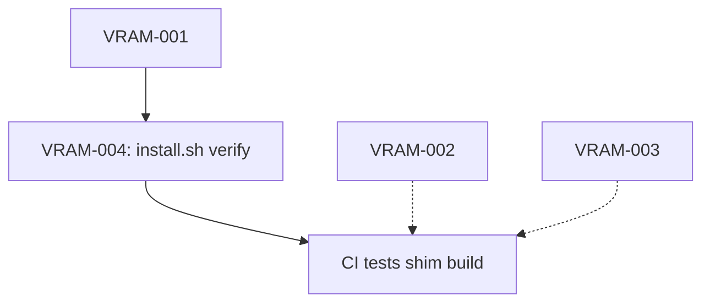

# Steam-VRAM-Manager — Track Index

## Active Tracks (v1.0 Scope)

| ID | Title | Status | Priority | Spec | Plan |
|----|-------|--------|----------|------|------|
| **VRAM-001** | Generalize `vram-wrapper` Hardcoded Paths | 🟡 **Ready** | 🔴 Critical | `specs/01-generalize-vram-wrapper-paths.md` | `plans/01-generalize-vram-wrapper-paths.md` |
| **VRAM-002** | systemd User Service (Log Rotation) | ⚪ Planned | 🟡 High | — | `plans/02-systemd-user-service.md` |
| **VRAM-003** | VRAM Limit Enforcement (LD_PRELOAD Shim) | ⚪ Planned | 🟢 Medium (v1.1) | — | `plans/03-vram-limit-enforcement.md` |
| **VRAM-004** | `install.sh` Hardening (Dry-Run, Verify) | ⚪ Planned | 🟡 High | — | `plans/04-install-hardening.md` |
| **VRAM-005** | CI Pipeline (shellcheck + bats + GH Actions) | ⚪ Planned | 🟡 High | — | `plans/05-ci-pipeline.md` |

## Track Status Definitions
| Status | Meaning |
|--------|---------|
| ⚪ **Planned** | Defined in `tracks/`, not started |
| 🟡 **Ready** | Spec + Plan written, implementation can begin |
| 🔵 **In Progress** | Actively being implemented |
| 🟢 **Done** | Implemented, tested, merged to main |
| 🔴 **Blocked** | Waiting on external dependency or decision |

## v1.0 Release Criteria
**Must Have (Blocking):**
- [ ] VRAM-001: Paths generalized — works for any user
- [ ] VRAM-004: Installer hardened — `--dry-run`, `--verify`, idempotent
- [ ] VRAM-005: CI pipeline — shellcheck + bats on every PR

**Should Have (Non-Blocking):**
- [ ] VRAM-002: systemd log rotation — nice to have, not critical for launch

**Won't Have (Deferred to v1.1+):**
- [ ] VRAM-003: VRAM enforcement shim — optional enhancement

## Track Dependencies

- **VRAM-001** must complete before **VRAM-004** verification tests can pass
- **VRAM-004** enables **VRAM-005** to test installer flags in CI
- **VRAM-002** and **VRAM-003** are independent but add CI test surface

## Capacity & Sequencing

### Recommended Order
1. **VRAM-001** (2 hrs) — Unblocks everything else
2. **VRAM-004** (1.5 hrs) — Hardens installer, enables CI verification
3. **VRAM-005** (3 hrs) — Locks in quality gate
4. **VRAM-002** (1 hr) — Polish, can run in parallel with 005
5. **VRAM-003** (3 hrs) — Defer to v1.1

### Parallelization
- VRAM-002 and VRAM-005 can run in parallel (different code areas)
- VRAM-003 is fully independent — can be done any time

## Archive / Completed
*None yet — project in initial Conductor setup*

---

*Track Index — 2026-09-20*